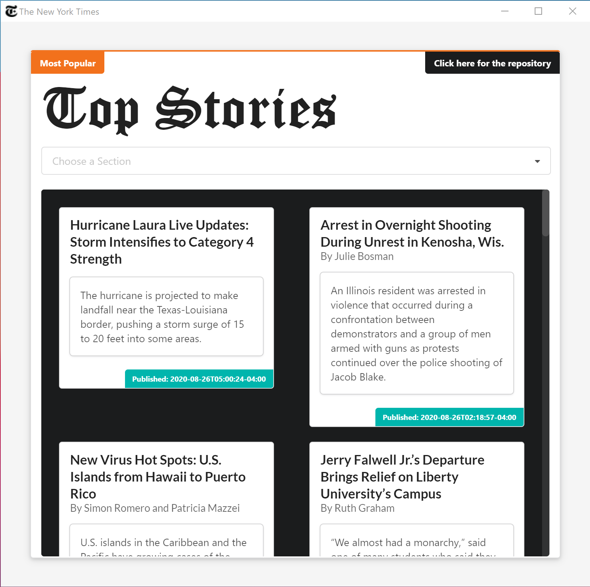

# The New York Times Snapshot

> Live Website: https://ahmedalihashi.github.io/nytimes/   

> Windows App Version Download [here](https://drive.google.com/file/d/1T3rpNWmfgOPKD_5EBAT9rD0j9iJVBn9l/view?usp=sharing) (win32 x64)

This is an app that displays the most viewed,shared and emailed articles of the last 30 days from [The New York Times](https://www.nytimes.com/) using their [api](https://developer.nytimes.com/).

</img>

## Quick Instructions

To create a light dev version

```
git clone https://github.com/AhmedAlihashi/nytimes.git
npm install or yarn install
npm run start or yarn start
```

## Windows Application
To create a light dev version

```
( If you don't have foreman installed: npm install -g foreman )
git clone https://github.com/AhmedAlihashi/nytimes.git
npm install or yarn install
npm run start or yarn start
```

Alternativly you can build your own version locally   

```
git clone https://github.com/AhmedAlihashi/nytimes.git
cd electron
npm install or yarn install
npm run build-win or yarn build~win
```
## ScreenShot

### Windows Application

<p float="left">
</img>
</img> 
</p>

